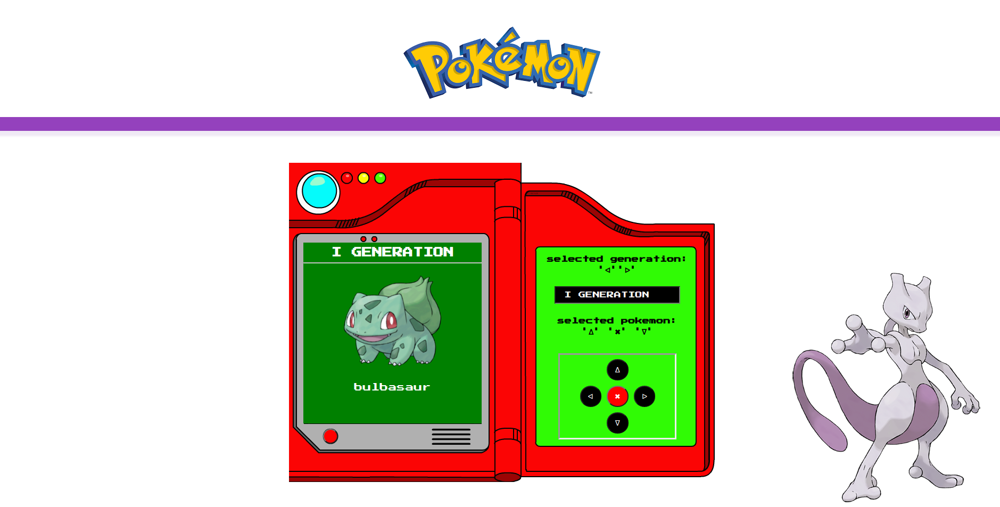
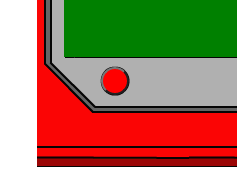
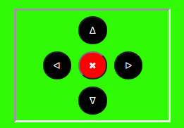

<p align="center">
  
</p>


<p align="center">
  
</p>
<p align="center" fontSize="60px">
  Projeto Pokedex original.
</p>

<p align="center">
  
</p>
<p align="center" fontSize="60px">
  Botão ligar/desligar.
</p>

<p align="center">
  
</p>
<p align="center" fontSize="60px">
  Controle direcional de seleção.
</p>

## 💻 Projeto (Em desenvolvimento)

## 📥 Instalação e execução

Faça um clone desse repositório e acesse o diretório.

```bash
$ git clone git@github.com:ARSJ13/pokedex.git && cd pokedex
```
```bash
# Instalando as dependências
$ npm install

# Executanto aplicação
$ npm start

```